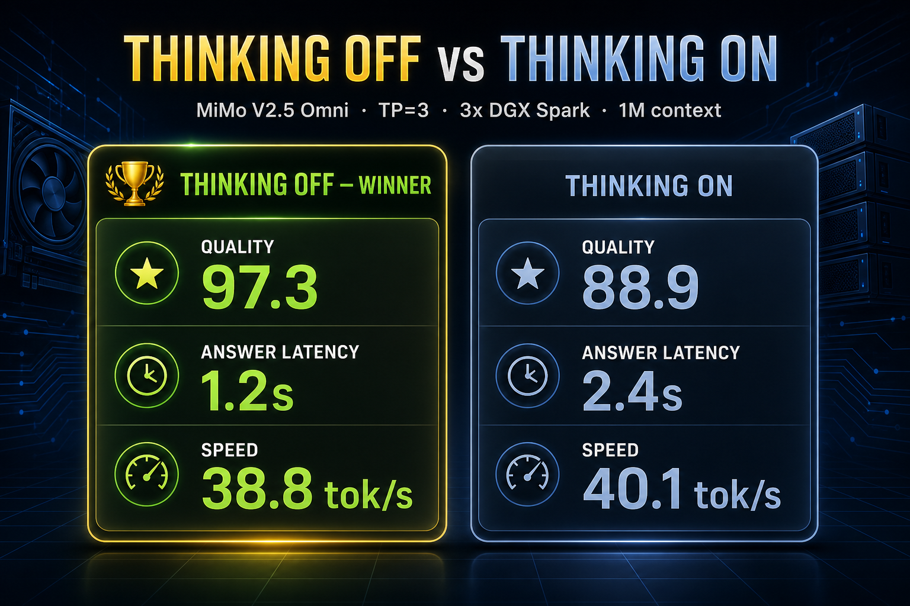

> # ⚠️ SUPERSEDED — use the current 3-Spark recipe
> This was an earlier 3-Spark build (MTP2). The current 3-Spark recipe — **NVFP4 4-bit KV, ~10.59M-token pool** — is here:
> ## 👉 https://github.com/tonyd2wild/MiMo-V2.5-TP3-NVFP4-KV-3xDGX-Spark

---

# MiMo V2.5 Omni on 3x DGX Spark

The definitive recipe and full benchmark writeup for serving the **MiMo V2.5 Omni** flagship fully multimodal (text, image, video, audio) at **1,000,000 token context** with **MTP2 speculative decoding** and **TP=3 across 3x NVIDIA DGX Spark (GB10)** over RoCE, with no switch.

This is the real, reproducible deployment we run in production. Every number on this page traces back to a benchmark JSON committed in [`benchmarks/`](benchmarks). Nothing here is estimated.

---

## What it is

- **Model:** [`lukealonso/MiMo-V2.5-NVFP4`](https://huggingface.co/lukealonso/MiMo-V2.5-NVFP4), 310B total parameters / 15B active (MoE), quantized to NVFP4.
- **Modalities:** full omni. Text, image, video, and audio, all verified live on this exact deployment.
- **Context:** 1,000,000 tokens, served, not theoretical.
- **Speculative decoding:** MTP2 (2 draft tokens) via the `MiMoV2OmniMTPModel` draft, sharing the target model's embedding and `lm_head`. Acceptance approximately 81% (position 0 approximately 92%).
- **Architecture:** `MiMoV2OmniForCausalLM` with a 729M-parameter Vision Transformer and a 261M-parameter audio encoder.
- **Topology:** TP=3 across 3 DGX Spark nodes (Bluey, Reddie, Asusi), GB10 silicon, connected over a RoCE fabric, no switch. vLLM with the Ray executor backend.
- **Serving:** OpenAI-compatible endpoint on the head node, port 8000.

The hard part is that MiMo cannot be sharded TP=3 by stock vLLM. We solved that with virtual-head padding, ported from the MiniMax M3 method onto MiMo's attention and MTP paths. See [The engineering](#the-engineering) below.

---

## Headline results

Thinking **OFF** is the production lane (tool-calling, agents, anything user-facing). Numbers below are 3-run averages on a 69-scenario tool-calling eval.

| Metric | Value |
|---|---|
| Quality | **97.3** |
| Responsiveness | **96.4** |
| Deployability | **97.3** |
| Decode throughput | **38.8 tok/s** |
| Effective throughput | **35.1 tok/s** |
| Median answer latency | **approximately 1.2 s** |
| Eval score (avg) | **134.3 / 138** (best run 135/138, Q97.8) |
| KV cache at full 1M | **3,127,938 tokens** |
| Concurrency headroom at 1M | **3.13x** |

Five stars, rated Excellent, across all three thinking-OFF runs.

---

## Thinking OFF vs ON



We ran the full 69-scenario eval three times in each mode. Same model, same hardware, same scenarios, the only difference is `enable_thinking`.

### Thinking OFF (production lane)

| Run | Quality | Score | Decode tok/s | Effective tok/s | Median latency (ms) |
|---|---:|---:|---:|---:|---:|
| Run 1 | 97.8 | 135/138 | 38.9 | 34.9 | 1228.6 |
| Run 2 | 96.4 | 133/138 | 38.8 | 35.2 | 1196.5 |
| Run 3 | 97.8 | 135/138 | 38.7 | 35.1 | 1168.3 |
| **Average** | **97.3** | **134.3/138** | **38.8** | **35.07** | **1197.8** |

### Thinking ON (optional deep reasoning)

| Run | Quality | Score | Decode tok/s | Effective tok/s | Median latency (ms) |
|---|---:|---:|---:|---:|---:|
| Run 1 | 88.4 | 122/138 | 40.0 | 38.0 | 2427.3 |
| Run 2 | 89.9 | 124/138 | 40.4 | 38.5 | 2370.4 |
| Run 3 | 88.4 | 122/138 | 40.0 | 38.2 | 2376.4 |
| **Average** | **88.9** | **122.7/138** | **40.13** | **38.23** | **2391.4** |

### The key finding

**Thinking OFF wins on quality (+8.4) AND on answer latency (2x faster).** Thinking ON only posts higher raw tokens per second, and that number is misleading, because thinking ON spends those tokens generating internal reasoning the user never reads. More tokens does not mean better answers. On this eval it meant slower answers and lower quality.

So the rule is simple:

- **Production, agents, tool-calling: thinking OFF.** Faster and more accurate.
- **Thinking ON:** optional, for genuinely hard standalone reasoning where you want the model to deliberate and you do not care about latency.

Set `enable_thinking=false` for the production lane. (See the [thinking-mode gotcha](#the-engineering) for why the eval harness default bites you here.)

---

## Concurrency

We swept concurrency from 1 to 8 simultaneous agents at the full 1M-context config (12 tool-calling scenarios, 8 requests per level). The takeaway: aggregate throughput climbs with concurrency, but per-agent throughput drops steeply. The GB10 is memory-bandwidth-bound. This box is at its best as a single-user or small-batch machine.

### Thinking OFF

| Concurrency | Aggregate tok/s | Per-agent tok/s | p50 turn latency (ms) | Quality |
|---:|---:|---:|---:|---:|
| 1 | 36.5 | 36.5 | 1230.6 | 91.7 |
| 2 | 50.3 | 25.1 | 1512.0 | 87.5 |
| 3 | 62.4 | 20.8 | 1979.7 | 87.5 |
| 4 | 60.1 | 15.0 | 2385.9 | 79.2 |
| 5 | 69.3 | 13.9 | 2644.8 | 87.5 |
| 6 | 70.5 | 11.8 | 2619.8 | 79.2 |
| 8 | 76.2 | 9.5 | 3437.6 | 70.8 |

### Thinking ON

| Concurrency | Aggregate tok/s | Per-agent tok/s | p50 turn latency (ms) | Quality |
|---:|---:|---:|---:|---:|
| 1 | 40.3 | 40.3 | 2523.2 | 75.0 |
| 2 | 55.6 | 27.8 | 3049.7 | 75.0 |
| 3 | 72.3 | 24.1 | 3688.4 | 75.0 |
| 4 | 61.1 | 15.3 | 4766.0 | 66.7 |
| 5 | 79.1 | 15.8 | 5131.6 | 66.7 |
| 6 | 85.7 | 14.3 | 5388.7 | 75.0 |
| 8 | 82.1 | 10.3 | 7398.9 | 75.0 |

The story: a single user gets roughly 40 tok/s. Push to 8 concurrent agents and per-agent throughput collapses to roughly 10 tok/s while latency climbs. Thinking OFF beats thinking ON at every concurrency level on both quality and latency. If you need to serve many users at once, you want a different topology. If you want one or a few fast, smart, omnimodal agents at a huge context, this is the box.

Full per-level data (TTFT, p95, error counts, decode and effective tok/s) lives in [`benchmarks/`](benchmarks) and is tabulated in [BENCHMARKS.md](BENCHMARKS.md).

---

## Omni and multimodal

All four modalities were verified live on this deployment, not inferred from the model card.

| Modality | Verification |
|---|---|
| Text | Solved `2 + 2 = 4`. |
| Image | Read a synthetic image, correctly reported "red square on the left, blue circle on the right". |
| Video | Described a real 4 second clip: a patio with a ceiling fan and a pool. |
| Audio | Heard a real clip and reported "rushing water, a pool fountain". |

### Usage notes (important, save yourself the debugging)

- **Vision requests need `max_tokens >= 768`.** If you set it lower, the model's answer lands in the reasoning field and the request hits the length limit before producing a visible answer.
- **Feed video and audio as separate content items** in one message: a `video_url` item and an `audio_url` item. Do not rely on the all-in-one MP4 path, which is flaky on audio extraction. Splitting the streams is reliable.
- **Use `max_tokens` of 2048 to 8192 for multimodal** requests so the model has room to describe what it sees and hears.
- `--limit-mm-per-prompt` is set to `image:4, video:1, audio:1` in the recipe. Adjust if you need more images per prompt.

---

## The engineering

This is the part that took the work. MiMo V2.5 does not shard TP=3 out of the box.

### Virtual-head padding (the core fix)

MiMo has **64 attention heads and 4 KV heads**. Neither is divisible by 3, so stock vLLM cannot split this model across 3 ranks. Tensor parallel sharding requires the head counts to divide evenly by the TP size.

The fix is **virtual-head padding**: pad the query heads from 64 to 96 and the KV heads from 4 to 6, so both divide by 3 (32 query heads and 2 KV heads per rank). The padded "virtual" heads are zero-masked so they contribute nothing to the output, they exist only to make the geometry divisible. This method was ported from the MiniMax M3 TP=3 work (vLLM commit `fb63c9a`) and applied to MiMo's attention class **and** to the MTP draft config path.

It ships as the mod [`mods/mimo-v2-tp3-virtual-heads/run.sh`](mods/mimo-v2-tp3-virtual-heads/run.sh) and is toggled by `VLLM_MIMO_V2_TP3_VIRTUAL_HEADS=1`. The mod installs a `pad_or_narrow_weight` loader that zero-fills out-of-range checkpoint tails, patches the QKV projection to expose padded head geometry, and patches the parameter loader so weights land in the right (padded) shards.

### FusedMoE zero-fill and padded-head metadata

An early TP=3 boot produced gibberish. The cause: the zero-padded NVFP4 FusedMoE tail was not truly zero-equivalent, so the uninitialized padded MoE region was corrupting output. The fix makes the padded FusedMoE region genuinely zero so the virtual heads cannot leak garbage into the result. The padded-head metadata was corrected at the same time so the attention machinery agrees on the padded geometry end to end.

### MTP attention_sink_bias fix

The MTP draft loader computed `64 // 3 = 21` for the local sink vector, while the TP3 virtual layout pads the local sink to 32. That mismatch broke the draft. The mod patches the `attention_sink_bias` loader so the sink bias is padded consistently with the virtual heads when `VLLM_MIMO_V2_TP3_VIRTUAL_HEADS=1` and `tp_size == 3`. With that fix the draft resolves correctly as `MiMoV2OmniMTPModel`, shares the target model's embedding and `lm_head`, and reaches approximately 81% acceptance (position 0 approximately 92%).

### Infrastructure

- **3-node RoCE fabric** with a per-node HCA map. NCCL is pinned to the RoCE subnets (`192.168.100.0/24`, `192.168.101.0/24`, `192.168.102.0/24`) via `NCCL_IB_ADDR_RANGE`, with `NCCL_IB_GID_INDEX=3` and `NCCL_CROSS_NIC=1`.
- **MTU 9000** (jumbo frames) across the fabric.
- **Ray executor** with `--object-store-memory 1073741824` (cap the plasma store so it does not eat node memory) and `RAY_memory_monitor_refresh_ms=0` (stop Ray's memory monitor from false-killing the head rank after warmup). These two settings are the difference between a clean boot and an OOM kill.
- **Worker-first launch:** bring up the worker nodes, then the head, so the collective forms cleanly.

### The thinking-mode gotcha

Run with `enable_thinking=false` for production. The eval harness (`run_eval.py`) defaults thinking **ON**. With thinking on, the model burns large token budgets on internal reasoning before answering. On hard scenarios this is pathological: we have seen a single scenario balloon to roughly 2003 seconds with thinking on versus 14.3 seconds with it off, an order-of-magnitude class slowdown, while also scoring lower. Across the full eval the effect is a clean 2x median-latency penalty and an 8.4-point quality drop (see the tables above). Off is both faster and better for tool-calling. Always disable thinking for the production and agent lanes.

---

## vs DeepSeek V4 Flash

We also run DeepSeek V4 Flash on this fleet, and the comparison is instructive because the two models make opposite tradeoffs.

| | DeepSeek V4 Flash | MiMo V2.5 Omni |
|---|---|---|
| Context | 1M | 1M |
| Nodes for 1M | 2 (MLA) | 3 (no MLA, virtual-head TP=3) |
| Throughput | approximately 46 tok/s | approximately 38.8 tok/s |
| Node efficiency | Higher (MLA folds KV) | Lower (needs the 3rd node) |
| Concurrency headroom at 1M | 2.84x | **3.13x** |
| Modalities | Text only | **Text, image, video, audio** |

DS4 is more node-efficient: it does 1M context on 2 nodes via MLA and runs a bit faster. But DS4 is **text only**. MiMo Omni needs the 3rd node (it has no MLA, so we lean on the virtual-head TP=3 method), and in exchange it matches the 1M context, edges DS4 on concurrency headroom at full 1M (3.13x vs 2.84x), and is **fully omnimodal**. It sees, it watches, it hears. That is the thing DS4 structurally cannot do. Different tools for different jobs: DS4 for dense text at maximum node efficiency, MiMo Omni when you need eyes and ears at a million tokens.

---

## Quickstart

1. **Hardware:** 3x NVIDIA DGX Spark (GB10), connected over a RoCE fabric (MTU 9000), no switch required for 3 nodes.
2. **Model:** pull [`lukealonso/MiMo-V2.5-NVFP4`](https://huggingface.co/lukealonso/MiMo-V2.5-NVFP4) to the HF cache on each node.
3. **Apply the mods**, including the core TP=3 patch [`mods/mimo-v2-tp3-virtual-heads/run.sh`](mods/mimo-v2-tp3-virtual-heads/run.sh), inside the vLLM container.
4. **Serve** using the primary recipe, [`recipe/WORKING-mimo-v25-tp3-omni-1mctx-6seq-mtp2-audio-20260620.yaml`](recipe/WORKING-mimo-v25-tp3-omni-1mctx-6seq-mtp2-audio-20260620.yaml). This is the full omni path including audio. The text-plus-image-plus-video variant is [`recipe/WORKING-mimo-v25-tp3-omni-1mctx-6seq-mtp2-20260620.yaml`](recipe/WORKING-mimo-v25-tp3-omni-1mctx-6seq-mtp2-20260620.yaml).
5. **Key knobs:** `tensor_parallel: 3`, `max_model_len: 1000000`, `max_num_seqs: 6`, MTP2 speculative config, `VLLM_MIMO_V2_TP3_VIRTUAL_HEADS=1`. Launch worker nodes first, then the head.
6. **At request time:** default `enable_thinking=false`. For multimodal, set `max_tokens` to 768 or higher for vision, 2048 to 8192 for video plus audio, and feed video and audio as separate content items.

The OpenAI-compatible endpoint serves on the head node, port 8000.

```bash
# health check once the cluster is up
curl http://<head-node>:8000/v1/models
```

---

## Repository contents

```
recipe/
  WORKING-mimo-v25-tp3-omni-1mctx-6seq-mtp2-audio-20260620.yaml   # primary: full omni incl audio
  WORKING-mimo-v25-tp3-omni-1mctx-6seq-mtp2-20260620.yaml         # secondary: text + image + video
mods/
  mimo-v2-tp3-virtual-heads/run.sh                                # the TP=3 virtual-head + MTP patch
benchmarks/
  ...-final69-thinkingoff-run1/2/3.json                           # 3 thinking-OFF eval runs
  ...-final69-thinkingon-run1/2/3.json                            # 3 thinking-ON eval runs
  ...-concurrency12-thinkingoff.json / .md                        # concurrency sweep, thinking OFF
  ...-concurrency12-thinkingon.json / .md                         # concurrency sweep, thinking ON
assets/
  thinking-off-vs-on.png                                          # comparison graphic
BENCHMARKS.md                                                     # full data appendix + methodology
README.md
LICENSE                                                          # MIT
```

---

## Credits

This config stands on a lot of other people's work. The base loader mods are not ours; here is the full chain:

- **Xiaomi MiMo team** for the base MiMo V2.5 model.
- **[lukealonso](https://huggingface.co/lukealonso)** for the `MiMo-V2.5-NVFP4` quant, the MiniMax M3 TP=3 virtual-head sharding method we ported onto MiMo, and the chthonic vLLM fork.
- **[eugr/spark-vllm-docker](https://github.com/eugr/spark-vllm-docker) PR #251 (a3refaat)** for the dual-Spark NVFP4 recipe and the base loader mods we build on: the Triton DiffKV attention path, MXFP8 dense dispatch, the DiffKV quantized-KV guard, the Prometheus route fix, and the per-node NCCL HCA keep.
- **vLLM** PR **#41797** (Triton DiffKV for SM 12.1) and PR **#41905** (MiMo 2.5 MTP > 1 token), and the [vLLM project](https://github.com/vllm-project/vllm) for the serving engine.
- **CyberTen / mclenithan** for earlier MiMo-V2.5-on-DGX-Spark recipe work.
- The **NVIDIA Developer Forums DGX Spark threads** for the community groundwork.
- **NVIDIA DGX Spark (GB10)** for the hardware.

Our contribution on top of all of the above: extending the TP=2 NVFP4 recipe to **TP=3 with virtual-head padding**, keeping **MTP** and the full **1M-token context** alive, and the **omnimodal** bring-up + benchmarks.

---

## License

MIT. See [LICENSE](LICENSE). Copyright (c) 2026 tonyd2wild (2Wild).
